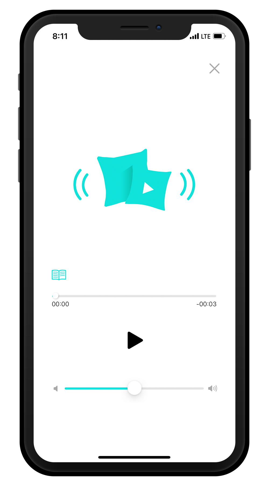

# Pillow-Tacotron

#
- Programmed in `#Swift`
- Google Vision API(OCR) + Tacotron
- Trained model is stored on a server and called through a custom API

[Xcode Project](./Pillow)
[Tacotron Model](./tacotron)
